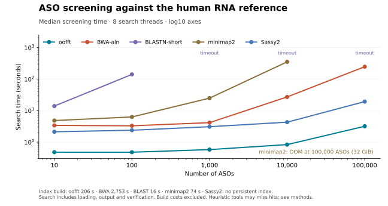

# oofft

Native Rust ASO candidate-site discovery, with a default
threshold of **three total edits** (substitutions plus inserted/deleted bases).
Sassy is **only an external benchmark comparator on EC2**, never a dependency.

Scientific basis: [Andersson et al. (2025), updated industry recommendations](https://doi.org/10.1089/nat.2024.0072). The handoff maps this framework to the computational scope and distinguishes project-specific choices.

The CLI searches annotated RNA-sense records using a native scalar-verified
search or a reusable FM index. Ensembl 110 reference preparation and EC2
benchmark iterations are recorded in [BENCHMARKS.md](BENCHMARKS.md).
Warm indexed search has exceeded 10× in both screening and full site enumeration.
The final 1,000-query report comparison measured **30.48 s versus 325.31 s**
median search plus CSV-output time (**10.67×**), with exact equality and uniqueness
of all **135,340,605 site tuples** across three repetitions. Whole-process time
was 10.57× faster. Without CSV output, the same search measured 12.94×.
These measurements use one search thread on the selected human RNA reference.
Cold starts and annotated output have separate costs;
this is not a universal 10× end-to-end claim. The optional Sassy AVX-512 build
failed in upstream code; its compiler log is retained. See [HANDOFF.md](HANDOFF.md) for the project brief and
[reference inputs](docs/reference.md) for the Ensembl 110 data choice.

The Raspberry Pi is the controller; substantial benchmarks run on a dedicated
EC2 CPU worker. No credentials belong in this repository.

Included fixtures are small sequence files and benchmark summaries. Large
reference genomes, indexes, raw alignment dumps and model credentials are not
included.

## Eight-thread screening benchmark



Each line shows the median of three screening runs for **10, 100, 1,000, 10,000
and 100,000 ASOs**, on log10 axes. Search includes reference/index loading,
output and independent witness verification. Reusable index-build costs are
excluded and listed in the caption. OS cache is retained; these are not
cold-start measurements.

Sassy2 now uses the same eight-CPU screening workload. At 100,000 ASOs, both
oofft and Sassy2 recover all 100,000 witnesses: **3.19 s versus 19.32 s** median
(**6.05×**). The earlier 10.67× result above is the separate one-thread full-output
comparison.

The reference is Ensembl 110 human RNA-sense gene bodies and transcripts, with
up to three edits. All tools receive eight CPUs where supported; BWA and BLAST
index builders are single-threaded. BLAST timed out from 1,000 ASOs upward;
minimap2 exhausted 32 GiB at 100,000. Heuristic comparators can miss valid hits:
at 100,000, BWA recovered 98.774% of native-positive queries. The largest batch
combines allele-derived and reference-derived SCN2A 20mers.

By default, **`oofft` returns one summary per ASO**, counting distinct genomic
sites at edit distances **0, 1, 2 and 3**, with no ddG calculation or per-hit output.
Indexed summaries share one reference across all available CPU workers.
Summary mode supports ASOs of 4–63 nt; screening and detailed reports currently
require 20mers. Human-reference benchmarks below use 20mers.
Add **`--genes`** for other-gene IDs or **`--sites`** for detailed hits.
A compact index reduced the measured Pi 5 sample to **3.00 GiB peak RAM**;
1,000 SCN2A ASOs took **75.2 s** on four threads. Full-gene time on the Pi has
not been measured. See [summary semantics, limits and commands](docs/SUMMARY.md).

Use **`oofft report`** for all annotated hits, including gene/transcript IDs,
chromosome, strand, genomic blocks and edit alignments. The graph measures
screening for one other-gene witness per ASO.

[Methods and reproducible EC2 jobs](docs/CLASSIC_BENCHMARK.md) ·
[Plot data](docs/images/classic-scaling.csv) ·
[Separate build time and memory data](docs/images/classic-index-builds.csv) ·
[Every iteration](benchmarks/CLASSIC_ITERATIONS.md)

## Relative hybridization energies

`oofft-ddg` annotates every reported off-target interval with a site-specific
ΔΔG using the independent Rust kernel (`--energy-engine rust`) or ViennaRNA
RNAduplex. It retains every hit, coordinate and discovery status. Use
`--whole-transcript --energy-engine vienna` for OligoAI's best-interaction scan
across the full RNA record.

```sh
oofft-ddg --sites hits.jsonl --queries queries.jsonl \
  --reference reference.jsonl --energy-engine rust --threads 4 > annotated-hits.jsonl
```

Use the same query and reference files as discovery; indexed-reference FASTA
is also accepted. Query `target` supplies the intended RNA sequence (5′→3′);
when absent, the perfect complement of the ASO is used and labelled explicitly.

Native site annotation measured **10.67× faster than ViennaRNA** with four
workers on EC2: 1.107 s versus 11.810 s for 273,825 sites from 100,000 distinct
SCN2A ASOs against SCN1A pre-mRNA. All output fields matched across three runs.
Eight workers reduced native time to 1.001 s (9.75× faster than matched Vienna).
These are complete annotation times, excluding discovery.

The earlier **whole-transcript** benchmark on the Raspberry Pi scored 128
distinct SCN2A ASOs against SCN1A pre-mRNA in **5.09 s versus 19.87 s** in
OligoAI v2 (3.90× faster; three repetitions). Every output field was checked
against the actual OligoAI function. This preserves its RNA:RNA model and sign;
it does not model modified gapmer chemistry explicitly.

See [usage, scientific assumptions and verification](docs/DDG.md) and
[all measured iterations](benchmarks/ddg/ITERATIONS.md). ViennaRNA is needed
for the Vienna backend and whole-transcript mode. Native site scoring does not
call or link ViennaRNA; its pulp backend automatically selects AVX-512/AVX2 on supported x86 CPUs,
NEON on 64-bit ARM (including Raspberry Pi), or scalar Rust.

The package and commands are now named **oofft** (`oofft`, `oofft-index`,
`oofft-ddg`). Existing benchmark artifacts retain the historical `ooff` identifier.

## Run the fixture

Install Rust with rustup, then:

```sh
cargo test --locked
cargo run --locked -- screen \
  --queries fixtures/queries.jsonl --reference fixtures/reference.jsonl \
  --policy other-gene --reference-release fixture-v1 \
  --scope synthetic --biotype-policy all-fixture-records
```

Use `report` to enumerate interval sites. `-k 0` through `-k 3` are supported;
the default is 3. `--max-sites N` caps each query in report mode and marks its
result `incomplete`. `--chunk-bases` controls the core length (default 65,536),
with 20+k overlap and ownership by site start to prevent duplicate chunk hits.
Build with `cargo build --release --locked` on the execution machine; the
configuration uses `target-cpu=native`. Keep substantial searches on EC2.

## Reuse an index

Build an index from RNA-sense FASTA whose headers are `record-id|gene-id[,gene-id]`:

```sh
OMP_NUM_THREADS=8 cargo run --release --locked --bin oofft-index -- build \
  --reference data/reference-v1/reference.fa --output data/fm-production-v1 \
  --shard-bases 1300000000
```

For `oofft screen` or `oofft report`, add `--index data/fm-production-v1`
and `--annotations data/reference-v1/records.jsonl`; `--reference` then names
that same FASTA. Queries remain JSONL. Annotation records follow FASTA order
and carry the same IDs, gene associations, strand and genomic blocks. All
index and reference files must remain immutable while mapped. Index creation
records source SHA-256 and FASTA offsets; reuse checks source identity and
metadata. Each emitted interval is independently aligned against the source
sequence to produce the final edit annotations.

The current full suffix-array index uses roughly 4.75 bytes per reference base,
about 11.6 GB for the selected human RNA records. Preparation, index loading,
and warm search timings are reported separately.

For the optional paired-direction search, build a second index with the same
FASTA and shard size plus `--reverse-records`, then pass its directory to
`oofft report --reverse-index DIR`. This reverses each record and the search
pattern together; it does not search a different biological strand. It doubles
index storage. The two directions constrain the first searched query half to
at most floor(k/2) edits, then union the results to retain full k-edit coverage.
The latest uncapped-report implementation merges matched sequence ranges before
expanding occurrences; see [algorithm and exactness argument](docs/ALGORITHM.md).

To avoid parsing all annotations on each invocation, validate them once:

```sh
target/release/oofft-index cache-annotations \
  --index data/fm-production-v1 --reference data/reference-v1/reference.fa \
  --annotations data/reference-v1/records.jsonl \
  --output data/fm-production-v1/annotation-cache.json
```

Then add `--annotation-cache data/fm-production-v1/annotation-cache.json` to
the CLI invocation. The cache records the validated annotation hash and file
metadata, and loads annotations as sites are emitted. Changed inputs require
rebuilding the cache; all mapped inputs must remain immutable during a run.

## Inputs and interpretation

Both inputs are JSONL, one object per line; see `fixtures/`. Queries require a
unique ID, a 20-base ASO sequence written 5′ to 3′, and intended gene IDs.
An optional allele string is retained as metadata. Ambiguous queries are rejected.
An optional numeric `ddg` field is also retained on emitted sites, without
changing search eligibility; the caller supplies its units and interpretation.

Reference records require a unique ID, RNA-sense sequence, all associated gene
IDs, contig, genomic strand, and genomic blocks in transcript order. Optional
transcript IDs preserve isoform associations. Blocks use zero-based half-open
coordinates and their lengths must sum to the sequence length. Supply a single
block for pre-mRNA gene bodies or exon blocks for mature transcripts. The caller
is responsible for correct annotation, provenance, and sequence orientation.
The reference builder is `benchmarks/build_reference.py`; its manifest records
the explicit selection policy. The CLI does not infer annotation completeness.

The engine reverse-complements each ASO to search the RNA-sense record. It
normalizes case and U/T, retains repeats, and splits records at IUPAC ambiguity.
Unknown bases are counted; a no-hit query is `incomplete` if any supplied
reference bases were unknown. Separate records are never concatenated.

`--policy other-gene` explicitly selects a sequence-screening rule: a site
qualifies if any associated gene is outside the query's intended-gene set.
This preserves off-target associations on shared records. Entirely intended-gene
records are excluded, so this policy **does not assess the spared allele**.
It is a project screening rule, not evidence of knockdown or clinical toxicity.

## Output and exactness scope

Output streams as JSONL: a manifest, sites, per-query summaries, and a final
`run_complete` marker. A nonzero process exit or missing marker means partial
output, regardless of any sites already written. The manifest includes input
SHA-256 hashes, release/scope/biotype labels supplied by the caller, normalization,
edit budget, limits, architecture and engine identity. Inputs must remain
unchanged during a run.

A distinct site is `(query ID, record ID, start, end)`, for every nonempty RNA
interval with full-query unit-cost Levenshtein distance ≤k. Overlapping sites
and terminal unpaired bases are included. Sites in different transcript records
remain distinct; counts are neither unique genomic-site counts nor gene counts.
One minimum-cost alignment per interval is reported. Traceback ties prefer
diagonal, then I, then D; alternative alignments with different positional
annotations are not enumerated.

CIGAR is in RNA-sense order (reverse ASO order): `I` consumes a query base only,
`D` consumes an RNA base only, `X` is a substitution, and `=` is a match.
Edits include original ASO coordinates/base identities, RNA bases, terminal-gap
labels, and 5-10-5 wing/gap annotations. An RNA-extra base has an ASO boundary
coordinate from 0 to 20, meaning after that many ASO bases in 5′ to 3′ order.
Chemistry annotations never exclude sites; experimental evidence remains null.

`screen` retires a query after its first qualifying witness; its distance is
`witness_edit_distance`, not a minimum across the reference. Endpoint discovery
currently scans the current chunk before witness verification; later chunks
are skipped for retired queries. `report` exhausts the supplied known sequence
unless capped. `none_found_within_scope` only describes this supplied scope.

The engine uses reusable FM indexes or native Myers endpoint discovery, followed
by scalar fixed-interval verification. Search is single-threaded; dense matches
can make interval verification and output expensive. Tests
compare endpoint/site sets against an independent scalar oracle for k=0..3,
single and mixed edits, repeats, boundaries, strand and multi-junction mappings;
these tests are evidence rather than a formal proof. Human-reference comparisons
also verify complete literal site tuples against the external comparator.

## Builds and releases

GitHub Actions tests Linux and macOS on Intel and ARM, verifies the source package,
and builds portable binaries. Version tags publish to crates.io and GitHub Releases
after all checks pass. See [release instructions](docs/RELEASING.md).

Site and whole-transcript ΔΔG use the Watt et al. convention: **off-target ΔG − intended-target ΔG** (kcal/mol); positive values indicate weaker off-target binding. Global site-energy caching is enabled by default; see [DDG documentation](docs/DDG.md).
